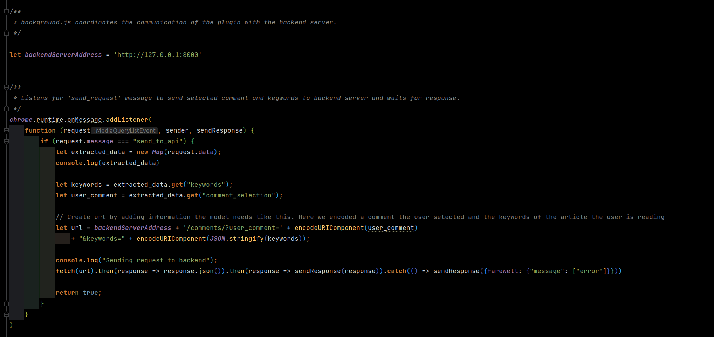
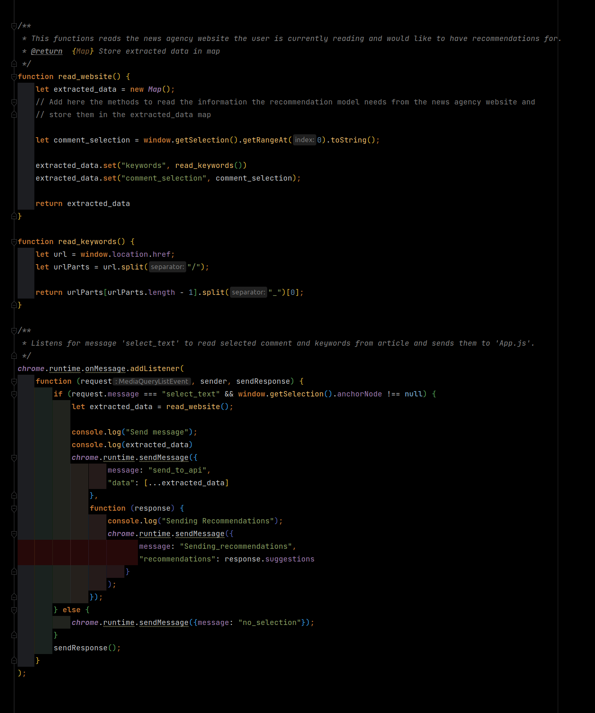

Update User Interface
=====================

If you want to use another user-interface or change certain aspects of the chrome extensions, you have to update the
``UI`` folder.

The chrome extension is build in a modular way to simplify customizations.

For the user interface, we use React components
to allow an easy replacement of certain aspectes of the user interface. You can find the different React components in the
``src/components`` folder.

The communications with the API is done with ``backgound.js`` file in the ``public`` folder. Here, you can change
the address of the API.

The interaction with the comment section of the news agency site takes place in ``contentScript.js`` in the ``public``
folder. Here, we read the keywords of the news article and the comment the user has selected. If you want to change
how the extension interacts with the site of the news agency, you do it here.

After you have changed something in the ``UI`` folder, you have to build the extension every time. For this run:

.. code-block:: bash

    $ npm run build

You also have to reload the chrome extension in extension menu in your chromium browser and to reload the site you would
like to interact with.